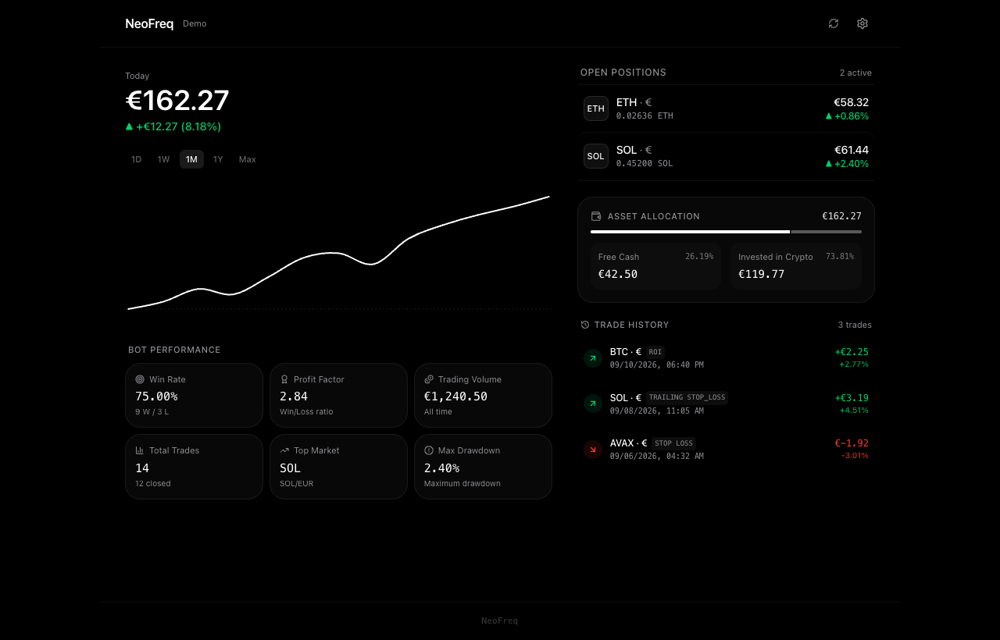

# NeoFreq

[](https://opensource.org/licenses/MIT)
[](https://github.com/jonashuberts/neofreq/actions/workflows/deploy.yml)
[](https://jonashuberts.github.io/neofreq/)

A minimalist, high-performance web dashboard and Progressive Web App (PWA) for monitoring [Freqtrade](https://www.freqtrade.io/) algorithmic cryptocurrency trading bots.

<p align="center">
  
</p>

## Overview

NeoFreq provides a distraction-free, typography-focused interface to monitor live crypto positions, account balances, and bot performance metrics in real time.

It is built mobile-first for iOS Safari (PWA standalone mode) and responsive across desktop and laptop screens (MacBook).

### Key Capabilities

- **Real-Time Portfolio Overview**: Clean hero valuation in `€` with dynamic return badge.
- **Pure Monochrome Sparkline Curve**: Minimalist Bezier line chart with touch and pointer scrubbing to inspect historical returns.
- **Active Positions**: Open trades displaying live market rates, current valuation, and % return. Detailed execution sheet reveals strategy, order history, stop-loss distance, leverage, and price range.
- **Asset Allocation**: Monochrome segmented bar showing free cash versus capital deployed in crypto assets.
- **Rich Bot Performance**: Win rate, profit factor, trading volume, total trades, top market/pair, and max drawdown.
- **Trade History**: Compact list of closed trades with exit reasons and realized returns.
- **Bilingual Interface (DE / EN)**: Native English and German localization with instant language switching in Settings.
- **Instant Demo Mode**: Test drive immediately with realistic simulated data on GitHub Pages or locally without needing a live bot connection.
- **Zero-Leak Privacy Architecture**: Server endpoints and authentication credentials are stored strictly in local browser storage or an untracked `.env.local` file. No personal IPs or credentials are ever committed to version control.

---

## Quick Start

### Installation

```bash
git clone https://github.com/jonashuberts/neofreq.git
cd neofreq
npm install
```

### Configuration

Copy `.env.example` to `.env.local`:

```bash
cp .env.example .env.local
```

Set your Freqtrade API server connection details in `.env.local`:

```env
VITE_FREQTRADE_URL=http://localhost:8080
VITE_FREQTRADE_USER=
VITE_FREQTRADE_PASSWORD=
VITE_POLL_INTERVAL=12000
VITE_DEMO_MODE=false
```

*(You can also configure or change these anytime directly in the in-app Settings drawer).*

### Development Server

```bash
npm run dev
```

Open [http://localhost:5173](http://localhost:5173) in your browser.

---

## Docker Deployment

Build and run using Docker Compose:

```bash
docker compose up -d --build
```

The dashboard will be served on port 3000 (`http://localhost:3000`).

---

## Freqtrade Configuration

To allow NeoFreq to connect to your Freqtrade bot, ensure the API server is enabled in your `config.json`:

```json
"api_server": {
    "enabled": true,
    "listen_ip_address": "0.0.0.0",
    "listen_port": 8080,
    "verbosity": "info",
    "enable_openapi": false,
    "jwt_secret_key": "YOUR_SECRET_KEY",
    "CORS_origins": ["*"],
    "username": "your_username",
    "password": "your_password"
}
```

If you prefer not to enable wildcard CORS on your Freqtrade instance, use the built-in **Local Proxy** mode in the dashboard settings or via the Vite development server.

---

## iOS Safari: Add to Home Screen

1. Open the dashboard URL in **Safari** on iOS.
2. Tap the **Share** button in the Safari toolbar.
3. Select **Add to Home Screen**.
4. Launch NeoFreq from your home screen for full-screen standalone app mode.

---

## Tech Stack

- **Framework**: React 19, Vite
- **Language**: TypeScript
- **Styling**: Tailwind CSS
- **Icons**: Lucide
- **CI/CD**: GitHub Actions (GitHub Pages deployment)

---

## License

This project is licensed under the [MIT License](./LICENSE).
