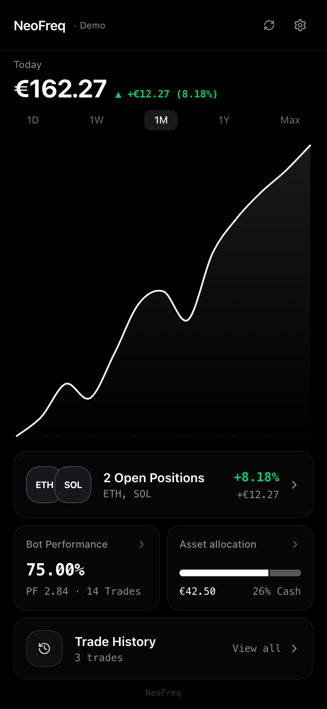

# NeoFreq

[](https://opensource.org/licenses/MIT)
[](https://github.com/jonashuberts/neofreq/actions/workflows/deploy.yml)
[](https://jonashuberts.github.io/neofreq/)

A minimalist web dashboard for monitoring [Freqtrade](https://www.freqtrade.io/) crypto trading bots.

<div align="center">
  <table>
    <thead>
      <tr>
        <th align="center">Desktop</th>
        <th align="center">Mobile</th>
      </tr>
    </thead>
    <tbody>
      <tr>
        <td align="center" valign="middle">
          
        </td>
        <td align="center" valign="middle">
          
        </td>
      </tr>
    </tbody>
  </table>
</div>

## Overview

NeoFreq is a clean, distraction-free interface to monitor active crypto positions, portfolio balance, and trading bot performance in real time. It is built mobile-first and responsive across all screen sizes.

### Features

- 📊 **Portfolio & Performance**: Real-time account balance, daily PnL curve, win rate, profit factor, and max drawdown.
- ⚡ **Open Positions**: Active trades with current valuation, profit/loss, stop-loss distance, leverage, and trade details.
- ⚖️ **Asset Allocation**: Breakdown of free cash versus capital allocated in crypto.
- 📜 **Trade History**: Log of closed trades with exit reasons and realized returns.
- 📱 **Mobile-First**: Fits on a single mobile screen without scrolling; detailed views open in clean sheets.
- 🌐 **Bilingual (DE / EN)**: Built-in English and German language switch in settings.
- 🧪 **Demo Mode**: Instant preview with simulated sample data.
- 🔒 **Privacy**: Credentials stay in your local browser (`localStorage`) or `.env.local`. No third-party servers.

<p align="center">
  <sub>💡 <b>Note:</b> The public GitHub Pages link runs a live simulated demo. For your private bot, host NeoFreq directly on your server (Docker) or use HTTPS.</sub>
</p>

---

## Quick Start

### Installation

```bash
git clone https://github.com/jonashuberts/neofreq.git
cd neofreq
npm install
```

### Configuration

Copy `.env.example` to `.env.local`:

```bash
cp .env.example .env.local
```

Set your Freqtrade API server connection details in `.env.local`:

```env
VITE_FREQTRADE_URL=http://localhost:8080
VITE_FREQTRADE_USER=
VITE_FREQTRADE_PASSWORD=
VITE_POLL_INTERVAL=12000
VITE_DEMO_MODE=false
```

*(You can also configure or change these anytime directly in the in-app Settings drawer).*

### Development Server

```bash
npm run dev
```

Open [http://localhost:5173](http://localhost:5173) in your browser.

---

## Docker Deployment

Build and run using Docker Compose:

```bash
docker compose up -d --build
```

The dashboard will be served on port 8085 (`http://localhost:8085`).

---

## Freqtrade Configuration

Ensure the API server is enabled in your Freqtrade `config.json`:

```json
"api_server": {
    "enabled": true,
    "listen_ip_address": "0.0.0.0",
    "listen_port": 8080,
    "verbosity": "info",
    "enable_openapi": false,
    "jwt_secret_key": "YOUR_SECRET_KEY",
    "CORS_origins": ["*"],
    "username": "your_username",
    "password": "your_password"
}
```

When running NeoFreq via Docker on the same server, API calls route automatically through the internal proxy to Freqtrade without CORS issues.

---

## Mobile Home Screen

You can add the dashboard directly to your home screen for full-screen use:
- **iOS (Safari)**: Tap the **Share** button ➔ **Add to Home Screen**.
- **Android (Chrome)**: Tap the menu (⋮) ➔ **Add to Home Screen / Install**.

---

## Tech Stack

- **Framework**: React 19, Vite
- **Language**: TypeScript
- **Styling**: Tailwind CSS
- **Icons**: Lucide
- **CI/CD**: GitHub Actions (GitHub Pages deployment)

---

## License

This project is licensed under the [MIT License](./LICENSE).
